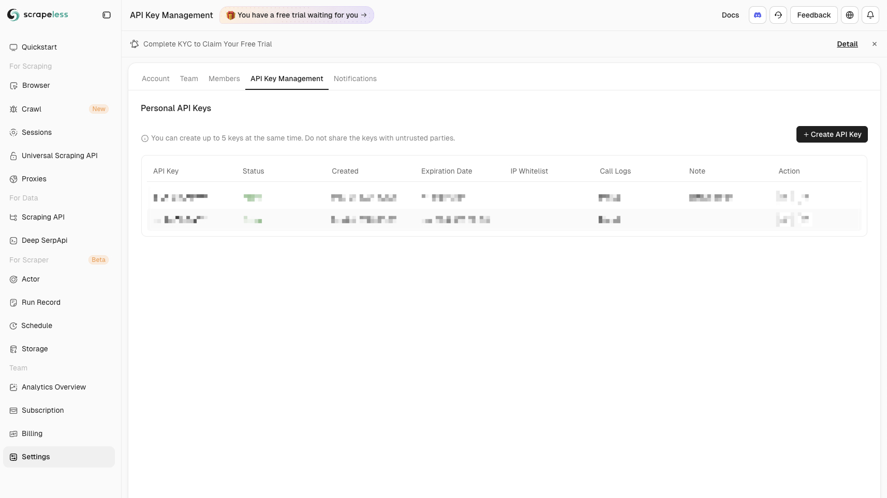

# n8n-node-scrapeless

> **Note:** This is NOT the official Scrapeless package. This is a community-maintained fork.
> For the official package, visit: https://github.com/scrapeless-ai/n8n-nodes-scrapeless

This repo contains a community node for n8n that integrates with Scrapeless.

## Installation

Follow the [installation guide](https://docs.n8n.io/integrations/community-nodes/installation/) in the n8n community nodes documentation.

Install this package using:
```
npm install @gabber235/n8n-nodes-scrapeless
```

## Credentials

You must have a Scrapeless API key to use this node. You can register for a free account to get an API key here:

https://app.scrapeless.com/passport/register

Once registered, you can find your API key here:


Then you'll need to create a credential in n8n for Scrapeless.



## Usage

Add the Scrapeless node to your workflow.


Configure a basic query and hit "Test step" to try a search.


## License

[MIT](https://github.com/gabber235/n8n-nodes-scrapeless/blob/main/LICENSE.md)
